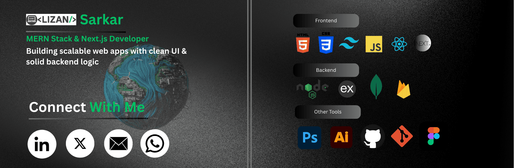

  

## 🚀 About Me  
Front-end Web Developer with expertise in building responsive, high-performance, and user-centric web applications.

## 🧩 Experience  
### **Frontend Developer (Intern) — Skill Paradox, Bangladesh**  
**Duration:** 5 Months  
**Location:** Bonani, Dhaka  

✔ Collaborated with **Code Zentro** to develop their digital service agency website  
✔ Worked on multiple small client projects  
✔ Improved website performance and UI consistency  
✔ Multitasked in design (Figma), frontend development, and content creation

---

## 🛠️ Technical Skills  

### **Frontend**

### **Backend**

### 🎨 Design Tools

  
  
  
  

### **Version Control**

  
  

---

## 📌 Featured Projects  

| # | Project Name | Live Link | Tech Stack | Major Features |
| :---: | :--- | :--- | :--- | :--- |
| **1** | **E Tuition Bd — Find Tutor Platform** | [E Tuition Bd](https://e-tuition-bd-c38ed.web.app/) | CSS3, Tailwind Css, JavaScript, React, Express, Mongodb ([Client GitHub link](https://github.com/lizansarkar/e-tuition-bd-client-side.git)) | This is a tuition website where you can find the tutor of your choice.It also has authentication features including frontend and backend. |
| **2** | **Dourao — Delivery Service Platform** | [Dourao](https://dourao.pages.dev/) | **MERN Stack** (MongoDB, Express.js, React, Node.js), Tailwind CSS, Firebase Auth | Backend integration for order management, User authentication, Database connectivity, Mobile-first responsive design |
| **3** | **Coze Zentro — Provide Digital Service** | [Code Zentro](https://code-zentro.netlify.app/) | **Front-End** Html5, Tailwind Css, React | This is for my agency. I only designed the frontend of this website and this is the 3rd website for our agency thats why. |

---

## 📊 GitHub Stats  

  <table>
    <tr>
      <td>
        
      </td>
      <td>
        
      </td>
    </tr>
  </table>

---

## 🌐 Connect With Me  

  
  
  
  

### Thanks for your attention❤️
