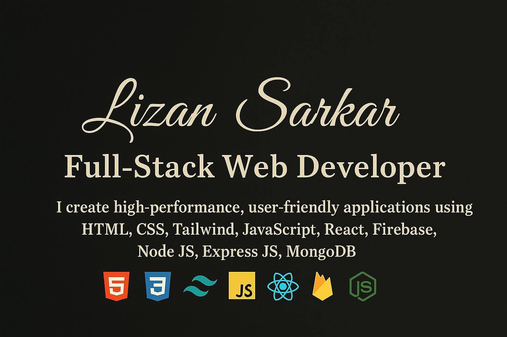

  

## 📊 GitHub Stats  

  <table>
    <tr>
      <td>
        
      </td>
      
      <td>
        
      </td>
    </tr>
  </table>

    <table>
    <tr>
      <td>
        
      </td>
      
      <td>
        
         
        
      </td>
    </tr>
  </table>

## 🚀 About Me  
Front-end Web Developer with expertise in building responsive, high-performance, and user-centric web applications.

---

## 🧩 Experience  
### **Frontend Developer (Intern) — Skill Paradox, Bangladesh**  
**Duration:** 5 Months  
**Location:** Bonani, Dhaka  

✔ Collaborated with **Code Zentro** to develop their digital service agency website  
✔ Worked on multiple small client projects  
✔ Improved website performance and UI consistency  
✔ Multitasked in design (Figma), frontend development, and content creation  

---

## 🛠️ Technical Skills  

### **Frontend**

### **Backend**

### **Design Tools**
Figma • Adobe Photoshop • Adobe Illustrator  

### **Version Control**
Git • GitHub  

---

---

## 📌 Featured Projects  

| # | Project Name | Live Link | Tech Stack | Major Features |
| :---: | :--- | :--- | :--- | :--- |
| **1** | **Code Zentro — Digital Service Agency** | [codezentro](https://skill-paradox.pages.dev/) | HTML5, CSS3, JavaScript, (Client GitHub link if available) | Real-time data updates, Responsive UI, Multi-page layout, Optimized performance |
| **2** | **Dourao — Delivery Service Platform** | [dourao](https://dourao.pages.dev/) | **MERN Stack** (React, Node.js, Express.js, MongoDB), Tailwind CSS, Firebase Auth | Backend integration for order management, User authentication, Database connectivity, Mobile-first responsive design |

---
---

## 📊 GitHub Stats  

  <table>
    <tr>
      <td>
        
      </td>
      <td>
        
      </td>
    </tr>
  </table>

---

## 🌐 Connect With Me  

### Thanks for your attention❤️
