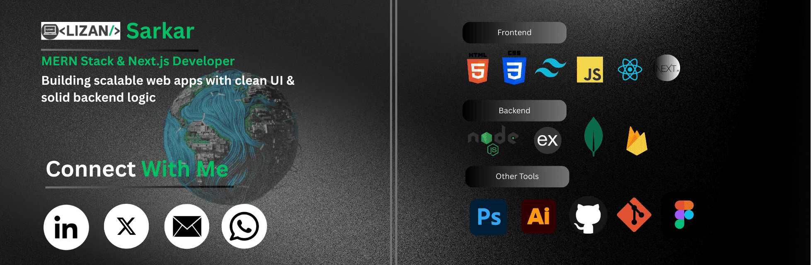

  

## 🚀 About Me  
Front-end Web Developer with expertise in building responsive, high-performance, and user-centric web applications.

## 🧩 Experience  
### **Frontend Developer (Intern) — Skill Paradox, Bangladesh**  
**Duration:** 6 Months  
**Location:** Bonani, Dhaka  

✔ Collaborated with **Code Zentro** to develop their digital service agency website  
✔ Worked on multiple small client projects  
✔ Improved website performance and UI consistency  

---

## 🛠️ Technical Skills  

### **Frontend**

   &nbsp;&nbsp;
   &nbsp;&nbsp;
   &nbsp;&nbsp;
   &nbsp;&nbsp;
   &nbsp;&nbsp;
  

### **Backend**

   &nbsp;&nbsp;
   &nbsp;&nbsp;
   &nbsp;&nbsp;
  

### 🎨 Design Tools

   &nbsp;&nbsp;
   &nbsp;&nbsp;
   &nbsp;&nbsp;
  

### **Version Control**

   &nbsp;&nbsp;
  

### **More I Know**

   &nbsp;&nbsp;
   &nbsp;&nbsp;
  

## 📌 Featured Projects  

| # | Project Name | Live Link | Tech Stack | Major Features |
| :---: | :--- | :--- | :--- | :--- |
| **1** | **E Tuition Bd — Find Tutor Platform** | [E Tuition Bd](https://e-tuition-bd-c38ed.web.app/) | CSS3, Tailwind CSS, JavaScript, React, Express, Mongodb ([Client GitHub link](https://github.com/lizansarkar/e-tuition-bd-client-side.git)) | This is a tuition website where you can find the tutor of your choice. It also has authentication features, including frontend and backend. |
| **2** | **Dourao — Delivery Service** | [Dourao](https://dourao.pages.dev/) | **MERN Stack** (MongoDB, Express.js, React, Node.js), Tailwind CSS, Firebase Auth | Backend integration for order management, User authentication, Database connectivity, Mobile-first responsive design |
| **3** | **Coze Zentro — Provide Digital Service** | [Code Zentro](https://code-zentro.netlify.app/) | **Front-End** Html5, Tailwind Css, React, React Router | This is for my agency. I only designed the frontend of this website, and this is the 3rd website for our agency, that's why. |

---

## 📊 GitHub Stats  

  <table>
    <tr>
      <td>
        
      </td>
      <td>
        
      </td>
    </tr>
  </table>

---

## 🌐 Connect With Me  

  <a href="mailto:lizansarkar16@gmail.com">
     &nbsp;&nbsp;
  </a>

  <a href="https://lizan-protfolio.pages.dev/" target="_blank">
     &nbsp;&nbsp;
  </a>

  <a href="https://leetcode.com/u/Z33VeyQvdf" target="_blank">
      &nbsp;&nbsp;
  </a>

  <a href="https://wa.me/8801929562566" target="_blank">
      &nbsp;&nbsp;
  </a>

  <a href="https://www.facebook.com/lizan.sarkar.2025" target="_blank">
      &nbsp;&nbsp;
  </a>

  <a href="https://x.com/LizanIslam35436" target="_blank">
      &nbsp;&nbsp;
  </a>
  
  <a href="https://www.linkedin.com/in/lizan-sarkar" target="_blank">
     &nbsp;&nbsp;
  </a>

### Thanks for your attention❤️
